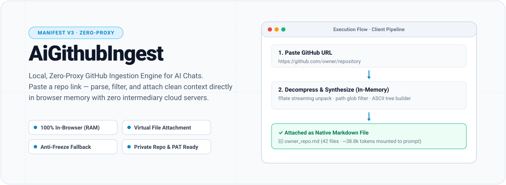
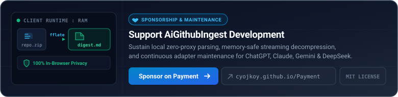

<div align="center">



# AiGithubIngest

**Local, Zero-Proxy GitHub Ingestion Engine for AI Conversations.**

Parse public and private GitHub repositories entirely inside your browser and seamlessly attach structured markdown context into your favorite AI chats upon pasting a link.

<p>
  
  
  
  
  
</p>

<p>
  <a href="#readme-overview">Overview</a> ·
  <a href="#readme-features">Key Features</a> ·
  <a href="#readme-mechanism">Mechanism & Architecture</a> ·
  <a href="#readme-supported-sites">Supported Platforms</a> ·
  <a href="#readme-quick-start">Quick Start</a> ·
  <a href="#readme-configuration">Configuration</a> ·
  <a href="#readme-versioning">Versioning</a> ·
  <a href="#readme-development">Development</a> ·
  <a href="#readme-support">Support</a> ·
  <a href="#readme-license">License</a>
</p>

</div>

---

<a name="readme-overview"></a>

##  Overview

Modern AI web applications (such as ChatGPT, Claude, and Gemini) struggle to digest full code repositories without tedious manual downloading or relying on risky third-party cloud ingestion proxies.

**AiGithubIngest** solves this by running an end-to-end repository parser entirely inside your client browser:

```text
Copy GitHub Repo URL
         ↓
Paste directly into an AI Chat Prompt
         ↓
AiGithubIngest intercepts paste event (in-memory)
         ↓
Fetches zipball directly from GitHub REST API / Codeload
         ↓
Streams & decompresses archive via fflate in RAM
         ↓
Applies smart path filters & generates an ASCII tree
         ↓
Mounts a single .md file directly as a native prompt attachment
```

Everything executes inside your local browser runtime—no telemetry, no intermediate proxies, and zero leakage of proprietary code or Personal Access Tokens (PATs).

---

<a name="readme-features"></a>

##  Key Features

- **100% Client-Side Parsing:** Repository zipballs are fetched and decompressed on the fly via `fflate` inside browser memory.
- **Universal File Attachment Injection:** Automatically scans for native `<input type="file">` controls, Clipboard events, or Drag-and-Drop state machines to attach the repository digest as an authentic markdown file—bypassing React 16+ controlled input traps.
- **Anti-Freeze Fallback Protection:** When direct file mounting is restricted by a host platform, it gracefully injects a lightweight ASCII directory tree and metadata header directly at the cursor, preventing browser hang caused by multi-megabyte raw text pasting.
- **Private Repository & PAT Support:** Supports user-configured GitHub Personal Access Tokens (PAT) stored safely in `chrome.storage.sync` to access private repositories and elevate API limits from 60 to 5,000 req/h.
- **Smart Filter & Heuristic Token Estimator:** Automatically excludes binaries, minified files, lockfiles, virtual environments, build artifacts, and oversized files (>100 KB default), and calculates token counts aligned with modern LLM tokenizers (GPT-4o / o200k_base).
- **Out-of-the-Box AI Site Policy:** Activates automatically on major AI platforms and allows custom domain whitelisting with one click from the popup interface.
- **Standalone Web UI Included:** Features a standalone web interface (`index.html`) for manual pasting, token entry, and one-click clipboard copying without requiring extension background scripts.
- **Modular Adapter Architecture:** Each AI platform is handled by an isolated adapter file. Adding a new site requires only adding one adapter and registering it—no modifications to the generic orchestrator.

---

<a name="readme-mechanism"></a>

##  Architecture & Mechanism

AiGithubIngest follows a strictly bounded, low-overhead WebExtension architecture. Every module has a single responsibility and follows the dependency direction enforced by `eslint-plugin-import/no-cycle`.

```text
┌─────────────────────────────────────────────────────────────────────────┐
│                       Browser Runtime Execution                         │
│                                                                         │
│  [ Web Page Context ]                                                   │
│    └─ src/content/                                                      │
│         ├─ index.ts           → bootstrap + idempotent listener install │
│         ├─ paste-handler.ts   → paste interception & message dispatch   │
│         ├─ policy-resolver.ts → hostname / editor / event resolution    │
│         ├─ storage-cache.ts   → chrome.storage cache + live updates     │
│         └─ spa-listener.ts    → history.pushState / popstate hooks      │
│                                                                         │
│    └─ src/dom/                                                          │
│         ├─ universal-editor.ts → adapter orchestrator (≤ 200 lines)     │
│         └─ adapters/                                                    │
│              ├─ types.ts                → SiteAdapter contract          │
│              ├─ show-picker-guard.ts    → shared showPicker patch       │
│              ├─ menu-upload-driver.ts   → shared menu-driven upload     │
│              ├─ doubao.ts               → Doubao-specific strategy      │
│              ├─ qwen.ts                 → Qwen-specific strategy        │
│              ├─ yuanbao.ts              → Yuanbao-specific strategy     │
│              ├─ generic-file-input.ts   → native input[type=file]       │
│              ├─ generic-paste.ts        → synthetic ClipboardEvent      │
│              └─ generic-dnd.ts          → synthetic DragEvent           │
│                                                                         │
│                                  ▲                                      │
│                                  │ chrome.runtime.sendMessage           │
│                                  ▼                                      │
│  [ Background Service Worker ]                                          │
│    └─ src/background/index.ts                                           │
│         └─ src/core/                                                    │
│              ├─ constants.ts       → INGEST_TIMEOUT_MS / ADAPTER_...    │
│              ├─ logger.ts          → unified structured logger          │
│              ├─ errors.ts          → DomainError + code enum            │
│              ├─ ingest-guard.ts    → re-entrancy lock + watchdog        │
│              ├─ ingest.ts          → pipeline orchestrator              │
│              ├─ github-engine.ts   → REST API / codeload zipball fetch  │
│              ├─ parser.ts          → Result<T, ParseError> URL parser   │
│              ├─ policy.ts          → whitelist / blacklist evaluation   │
│              ├─ file-filter.ts     → glob & binary filter rules         │
│              ├─ tree-builder.ts    → priority-sorted ASCII tree         │
│              ├─ output-formatter.ts→ markdown digest assembly           │
│              ├─ token-estimator.ts → sub-word heuristic token counter   │
│              ├─ i18n.ts            → zh-CN / en dictionaries            │
│              └─ result.ts          → Ok / Err / map / flatMap           │
│                                                                         │
│  [ Extension Action Popup ]                                             │
│    └─ src/popup/                                                        │
│         ├─ popup.ts             → DOMContentLoaded bootstrap (≤ 30 L)   │
│         ├─ popup-render.ts      → top-level render orchestration        │
│         ├─ site-policy-view.ts  → badge / toggle / blacklist button     │
│         ├─ blacklist-view.ts    → tag rendering + add logic             │
│         └─ token-view.ts        → PAT save / clear / show-hide          │
└─────────────────────────────────────────────────────────────────────────┘
```

### Architectural invariants enforced by CI

| Boundary | Rule |
|---|---|
| `src/types` | No runtime dependencies; all shared types live here |
| `src/core` | Pure logic only — no DOM, no `chrome.*`, no `window` |
| `src/dom/adapters` | One file per platform; each ≤ 250 lines |
| `src/content` | No repository parsing; delegates to background |
| `src/background` | No DOM access |
| `src/popup` | No ingest logic; only settings UI + storage |
| Circular imports | Forbidden (`import/no-cycle` is an error) |

### Universal Mounting Strategy (adapter chain)

`UniversalEditor.attachVirtualFile()` iterates a priority-ordered adapter list. Each adapter is wrapped in a 5-second timeout (`ADAPTER_TIMEOUT_MS`) and the first one to return `success: true` wins:

1. **Platform adapters** — Doubao / Qwen / Yuanbao (menu-driven, `showPicker` interception)
2. **Generic file input** — native `<input type="file">` prototype `files` setter
3. **Generic paste** — synthetic `ClipboardEvent('paste')` with `DataTransfer`
4. **Generic drag & drop** — cascaded `dragenter` / `dragover` / `drop`
5. **Cursor insertion fallback** — lightweight ASCII tree (avoids browser freeze on multi-MB pastes)

### Adding a new platform adapter

Because platform logic is fully decoupled, integrating a new AI site requires only three steps:

```ts
// 1. Create src/dom/adapters/my-site.ts
import { SiteAdapter } from './types';

export const mySiteAdapter: SiteAdapter = {
  id: 'my-site',
  matches: (host) => host.includes('my-site.com'),
  attach: async (file, ctx) => {
    // Your platform-specific mounting logic here.
    // Return { success: true, method: 'my-site' } on success.
    return { success: false, method: 'my-site' };
  },
};

// 2. Register it in src/dom/universal-editor.ts
const adapters: readonly SiteAdapter[] = [
  mySiteAdapter, // ← add here, ordered before generic adapters
  doubaoAdapter,
  // ...
];
```

No changes to `paste-handler.ts`, `content/index.ts`, or any other module are required.

---

<a name="readme-supported-sites"></a>

##  Supported Platforms

Built-in support is active by default on leading AI chat platforms:

| Platform              | Domain                           | Default Status                |
| :-------------------- | :------------------------------- | :---------------------------- |
| **ChatGPT**           | `chatgpt.com`, `chat.openai.com` | Built-in (Always Active)      |
| **Claude**            | `claude.ai`                      | Built-in (Always Active)      |
| **Google Gemini**     | `gemini.google.com`              | Built-in (Always Active)      |
| **DeepSeek**          | `chat.deepseek.com`              | Built-in (Always Active)      |
| **Poe**               | `poe.com`                        | Built-in (Always Active)      |
| **Perplexity**        | `perplexity.ai`                  | Built-in (Always Active)      |
| **Kimi**              | `kimi.moonshot.cn`               | Built-in (Always Active)      |
| **ChatGLM**           | `chatglm.cn`                     | Built-in (Always Active)      |
| **Tongyi Qianwen**    | `tongyi.aliyun.com`              | Built-in (Always Active)      |
| **Microsoft Copilot** | `copilot.microsoft.com`          | Built-in (Always Active)      |
| **Doubao**            | `doubao.com`                     | Built-in (Dedicated Adapter)  |
| **Qwen**              | `qwen.ai`, `qianwen.com`         | Built-in (Dedicated Adapter)  |
| **Tencent Yuanbao**   | `yuanbao.tencent.com`            | Built-in (Dedicated Adapter)  |
| **Custom AI Sites**   | _Any domain_                     | Whitelist via Extension Popup |

---

<a name="readme-quick-start"></a>

##  Quick Start

### Option A: Install Release Archive (Recommended)

1. Download the latest `ai-github-ingest-extension.zip` from [Releases](https://github.com/CYoJkoY/AiGithubIngest/releases).
2. Unpack the `.zip` archive to a persistent local folder.
3. Open Chrome or any Chromium browser (Edge, Brave) and navigate to `chrome://extensions/`.
4. Enable **Developer mode** in the top-right corner.
5. Click **Load unpacked** and select the unzipped directory.

### Option B: Build from Source

Ensure you have **Node.js >= 22** and **pnpm** installed:

```bash
# Clone the repository
git clone https://github.com/CYoJkoY/AiGithubIngest.git
cd AiGithubIngest

# Install dependencies (frozen lockfile)
pnpm install --frozen-lockfile

# Typecheck and build bundle into dist/
pnpm run build
```

Then load the resulting `dist/` directory as an unpacked extension in your browser.

---

<a name="readme-configuration"></a>

##  Configuration

Click the extension icon in your browser toolbar to open the settings popup:

- **Site Policy:** Inspects current tab status. Toggle any domain into the custom whitelist or blacklist.
- **GitHub Token:** Enter a Personal Access Token (classic with `repo` scope or fine-grained read token). This allows accessing private repositories and raises API rate limits to 5,000 requests/hour.
- **Language:** Switch between English and Simplified Chinese (`zh-CN`).

---

<a name="readme-versioning"></a>

##  Versioning Strategy

AiGithubIngest uses a single stable release channel.

| Item | Rule |
| :--- | :--- |
| `manifest.version` | Must be `X.Y.Z` |
| `manifest.version_name` | Removed and forbidden |
| `package.json.version` | Always tracks `manifest.version` |
| Git Tag | `vX.Y.Z` only |
| GitHub Release | Normal release, not a pre-release |

Key rules:

- `manifest.version` is the only version source of truth.
- `package.json.version` must always equal `manifest.version`.
- Development tags such as `vX.Y.Z.devN` are no longer supported.
- `manifest.version_name` must not be present.
- GitHub Releases are always published as regular releases.
- `sync-manifest-version.yml` keeps `package.json` aligned with `manifest.version` on every `main` push.

### Publishing a stable build

1. Edit `manifest.json`:

   ```json
   {
     "version": "0.6.0"
   }
   ```

2. Ensure `package.json` is also `0.6.0`. The sync workflow will align it automatically on `main`.
3. Commit to `main`.
4. Tag and push:

   ```bash
   git tag v0.6.0
   git push origin v0.6.0
   ```

5. The release workflow validates the tag against `manifest.version`, builds ZIP/CRX, and publishes a normal GitHub Release.

### Notes

- `manifest.version_name` is no longer used. Do not add it back to `manifest.json`.
- Do not create tags with a `.devN` suffix.
- Never paste a `version_name` value into any field Chrome treats as strict semver.

---

<a name="readme-development"></a>

##  Development & Quality Gates

AiGithubIngest follows strict contract verification, zero-runtime-waste engineering standards, and a modular adapter architecture that keeps platform-specific logic fully decoupled from generic orchestration.

### Local verification

```bash
# Install dependencies
pnpm install --frozen-lockfile

# Full local verification (typecheck + lint + format + test + build)
pnpm verify

# Individual gates
pnpm typecheck       # tsc --noEmit
pnpm lint            # eslint .
pnpm format:check    # prettier --check .
pnpm format          # prettier --write . (auto-fix style)
pnpm test            # vitest run --coverage
pnpm build           # tsc --noEmit && node build.mjs
```

### Quality thresholds enforced in CI

| Item | Target | Hard limit | ESLint rule |
|---|---:|---:|---|
| Lines per file | ≤ 300 | 400 | `max-lines` |
| Lines per function | ≤ 50 | 80 | `max-lines-per-function` |
| Cyclomatic complexity | ≤ 10 | 15 | `complexity` |
| Nesting depth | ≤ 3 | 4 | `max-depth` |
| Function parameters | ≤ 4 | 5 | `max-params` |
| Function statements | ≤ 30 | 40 | `max-statements` |
| Nested callbacks | ≤ 3 | 4 | `max-nested-callbacks` |

Exemptions apply to `src/types`, constants files, i18n dictionaries, and platform adapter files (relaxed to 250 lines but must remain single-purpose).

### Coverage requirements

- `src/core` lines ≥ **80%**
- `src/core` branches ≥ **70%**
- New adapters must include DOM fixture tests or an explicit exemption note in the PR

### Blocking CI gates

The following conditions fail the build:

- Type errors (`tsc --noEmit`)
- Lint errors (`eslint .`)
- Format check failures (`prettier --check .`)
- Test failures or coverage below threshold (`vitest run --coverage`)
- Circular dependencies (`import/no-cycle`)
- Files or functions exceeding hard limits without an exemption
- Non-deterministic build output (clean worktree check)

### CI / CD Workflows

- **`ci.yml`**: Runs `tsc --noEmit`, `eslint .`, `prettier --check .`, `vitest run --coverage`, manifest version contract validation, extension bundle build, and clean-worktree verification on every push to `main` and every PR.
- **`release.yml`**: Verifies that git tags (`vX.Y.Z`) match `manifest.json` `version`, validates critical artifact files (`background.js`, `content.js`, `popup.html`, etc.), and packages both signed CRX3 and ZIP distributions. All releases are normal GitHub Releases; development tags and `version_name` are no longer supported.
- **`sync-manifest-version.yml`**: Automatically syncs `package.json` to the authoritative `manifest.version` single source of truth upon main-branch updates.

### Architecture enforcement

All cross-module imports must respect the following dependency direction. Violations are blocked by `eslint-plugin-import/no-cycle`:

```text
src/types       ← (no runtime deps)
src/core        → types, result, i18n
src/background  → core, types, chrome.*
src/content     → core, dom, ui, types, chrome.*
src/dom         → types, generic DOM APIs
src/popup       → core/policy, core/i18n, types, chrome.*
src/ui          → types
```

Forbidden directions:
- `core` → `dom`, `content`, `popup`, `background`, `ui`
- `background` → `dom`, `content`, `popup`, `ui`
- `content` → `popup`, `background` internals
- `dom` → `background`, `popup`, `chrome.storage`
- `popup` → `content`, `dom`, `background` internals
- `ui` → any business module

### Code style conventions

- **Files**: `kebab-case`
- **Classes and types**: `PascalCase`
- **Functions and variables**: `camelCase`
- **Constants**: `UPPER_SNAKE_CASE`
- Named exports only; default exports are avoided
- `any` is forbidden; `tsconfig` strict mode is mandatory
- Hard-coded user-visible copy must go through `src/core/i18n.ts`
- Empty `catch` blocks are forbidden; use `logger.warn` / `logger.error`
- All async flows must have a timeout and a degradation path
- All global event listeners must have cleanup or idempotency protection

---

<a name="readme-support"></a>

##  Support & Sponsorship

Maintaining browser-extension compatibility across rapidly evolving AI web applications, rate-limit defenses, and memory-safe streaming decompression requires continuous testing and maintenance.

<div align="center">

<a href="https://cyojkoy.github.io/Payment/">
  
</a>

<br>

**Direct sponsorship link:** [https://cyojkoy.github.io/Payment/](https://cyojkoy.github.io/Payment/)

<sub>Sponsorship funds ongoing maintenance, cross-browser compatibility hardening, and dependency audits.</sub>

</div>

---

<a name="readme-license"></a>

##  License

This project is open-source and released under the [MIT License](LICENSE).
